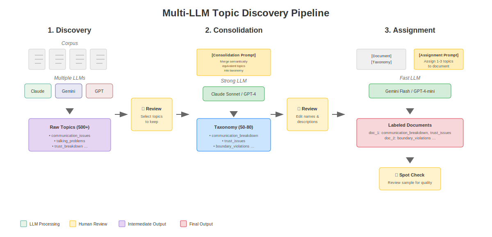

# Multi-LLM Topics: Ensemble Topic Discovery

[](https://multi-llm-topics.streamlit.app)

**Try it now:** [multi-llm-topics.streamlit.app](https://multi-llm-topics.streamlit.app) — A web app for discovering topics in your text data using multiple AI models. Upload a CSV, select your models, and download labeled results. No installation required.

> **Work in Progress.** This tool is under active development. The core pipeline works, but expect rough edges and changes.

A topic modeling approach that uses multiple LLMs to discover, consolidate, and assign topics from text corpora. By leveraging diverse models from different providers, this approach produces more robust and comprehensive topic taxonomies than any single model.

---

## Requirements

**Option A: OpenRouter API key (cloud models).** This tool uses [OpenRouter](https://openrouter.ai) as a unified gateway to access models from OpenAI, Anthropic, Google, Mistral, DeepSeek, and others through a single API.

- Sign up at [openrouter.ai](https://openrouter.ai) (free, takes 1 minute)
- New accounts receive free credits to get started
- You pay per API call; costs vary by model (see [Cost Estimates](#cost-estimates-via-openrouter) below)
- Models with `:free` suffix cost nothing
- Typical analysis of a few hundred documents: **$0.50–$2.00** (or free with `:free` models)

**Option B: Ollama (local models).** Run models locally for free using [Ollama](https://ollama.com). No API key needed.

- Install Ollama: `curl -fsSL https://ollama.com/install.sh | sh`
- Pull a model: `ollama pull llama3.2` (or `mistral`, `gemma2`, etc.)
- Enable Ollama in the app sidebar under "Local Models"
- Cost: **$0** (runs on your hardware)

---

## Quick Start (5 minutes)

**Step 1: Install & Run**

Open Terminal (Mac) or Command Prompt (Windows) and run:

```bash
pip install -r requirements.txt
streamlit run app.py
```

A browser window will open with the app.

**Step 2: Use the App**

1. Choose your models:
   - **Cloud models**: Paste your OpenRouter API key in the sidebar
   - **Local models**: Enable Ollama in the sidebar (must have Ollama running)
2. Upload your CSV file (must have a text column)
3. Go through the tabs: **Discovery** → **Consolidation** → **Assignment** → **Results**
4. Download your results as CSV

**Try it out:** A `sample_data.csv` file is included to test with.

**Cost:** $0.50–$2.00 for a few hundred documents using cheap cloud models, or **free** with Ollama or `:free` models.

---

## Why Not Traditional Topic Modeling?

Traditional approaches like LDA and BERTopic discover patterns based on lexical co-occurrence. In domain-specific corpora where vocabulary is relatively uniform, these methods struggle to distinguish semantically distinct categories.

For example, relationship advice posts share common vocabulary—words like "feel," "want," "relationship," "time"—regardless of whether they describe infidelity, communication problems, or financial conflicts. A BERTopic baseline on a relationship advice corpus produced only 2 topics, both characterized by generic function words rather than meaningful problem types.

**LLM-based topic discovery** addresses this by leveraging semantic understanding rather than lexical patterns. When an LLM categorizes a post, it applies interpretive frameworks to distinguish between conceptually different problems that use similar vocabulary.

## Why Multiple LLMs?

Different LLMs encode different cultural assumptions and granularity preferences. Our experiments show:

- **Zero exact string overlap** between models processing the same content
- **Claude Haiku** prioritizes mental health framing (14.5% of topics reference psychological concepts)
- **DeepSeek** emphasizes power dynamics (labeling jealousy as "partner possession control")
- **GPT-4.1-nano** operates at high abstraction, subsuming specific issues under broad categories
- **Gemini Flash** produces fine-grained distinctions (343 unique topics vs GPT's 29)

These aren't errors—they're complementary perspectives. Multi-model discovery produces 930 unique labels that, when consolidated, yield more robust taxonomies than any single model.

## Why LLM Consolidation?

Consolidating hundreds of topic labels requires recognizing semantic equivalence while preserving meaningful distinctions. We compared two approaches:

**Embedding clustering** (using sentence embeddings + agglomerative clustering) creates problematic groupings: it collapses "controlling behavior," "communication breakdown," "sexual coercion," and "lifestyle differences" into a single cluster because they're lexically related. Embedding similarity captures surface relatedness but cannot distinguish topics that require different treatment.

**LLM consolidation** groups topics by semantic meaning rather than surface similarity. It preserves distinctions that matter: separating "jealousy from insecurity" vs "jealousy from suspicious behavior," or "boundary violations" vs "controlling abusive behavior."

The tool includes both approaches—embedding clustering is useful for validation, confirming that LLM-produced categories correspond to genuine semantic structure.

## Pipeline



```
1. DISCOVERY    →  Multiple LLMs discover topics independently
                   (e.g., 930 unique labels from 6 models)
        ↓
   TOPIC REVIEW →  Human selects which topics to keep
                   (filter out noise, duplicates, irrelevant topics)

2. CONSOLIDATION →  Strong LLM merges semantically equivalent topics
                   (e.g., 930 → 70 categories)
        ↓
   TAXONOMY REVIEW →  Human edits category names/descriptions
                      (refine labels, exclude categories)

3. ASSIGNMENT   →  Fast LLM assigns 1-3 topics per document
                   (multi-label classification)
        ↓
   SPOT CHECK   →  Human reviews sample of assignments
                   (verify quality before export)
```

### Human Verification Steps

The pipeline includes three human-in-the-loop verification stages:

1. **Topic Review** (after Discovery)
   - Checkbox list to select/deselect discovered topics
   - Select All / Deselect All / Multi-Model Only controls
   - Must approve before consolidation proceeds

2. **Taxonomy Review** (after Consolidation)
   - Editable table: category name, description, include/exclude
   - Edit category names and descriptions inline
   - Must approve before assignment proceeds

3. **Spot Check** (after Assignment)
   - Random sample of 15 assignments shown with original text
   - 👍/👎 ratings to assess quality
   - Informational only (doesn't block export)

### Structured Prompts

Each pipeline stage uses a customizable prompt that instructs the LLM how to respond. You can edit these prompts in the app's "Advanced" expander for each stage.

#### Discovery Prompt

The discovery prompt is called once per document sample. It receives:
- `{topics}` — List of already-discovered topics (grows as discovery progresses)
- `{post}` — The document text to analyze

The LLM must return JSON with:
```json
{"action": "existing" or "new", "topic": "topic_label", "description": "..."}
```

The prompt encourages reusing existing topics when appropriate, creating new ones only when needed. Topic labels should be descriptive, generalizable, and use `lowercase_with_underscores` format.

#### Consolidation Prompt

The consolidation prompt is called once with all discovered topics. It receives:
- `{n_topics}` — Number of raw topics
- `{topics}` — All discovered topics with descriptions

The LLM must return JSON with:
```json
{
  "taxonomy": [
    {"topic": "label", "description": "...", "source_topics": ["merged", "topics"]}
  ],
  "unmapped": []
}
```

The prompt instructs the LLM to merge semantically equivalent topics while preserving meaningful distinctions, aiming for 50-80 final categories.

#### Assignment Prompt

The assignment prompt is called once per document. It receives:
- `{n_topics}` — Number of taxonomy categories
- `{taxonomy}` — The consolidated taxonomy with descriptions
- `{post}` — The document text to classify

The LLM must return JSON with:
```json
{"primary_topic": "main_topic", "secondary_topics": ["other1"], "reasoning": "..."}
```

The prompt instructs the LLM to select 1-3 topics per document, prioritizing the primary topic and only adding secondary topics if clearly applicable.

#### Customization Tips

- **Domain-specific examples**: Replace the generic topic examples with ones from your domain
- **Granularity**: Adjust "aim for 50-80 final topics" to control taxonomy size
- **Topic format**: Change `lowercase_with_underscores` to another format if preferred
- **Assignment strictness**: Modify rules to allow more or fewer topics per document

## Installation

```bash
pip install -r requirements.txt
```

For CLI usage, set your API key as an environment variable:
```bash
export OPENROUTER_API_KEY="your-key-here"
```

## Running Locally with Ollama (Free)

Run the entire pipeline on your machine with zero API costs using [Ollama](https://ollama.com).

**Step 1: Install Ollama**
```bash
# Mac/Linux
curl -fsSL https://ollama.com/install.sh | sh

# Or download from https://ollama.com for Mac/Windows
```

**Step 2: Pull some models**
```bash
ollama pull llama3.2        # Fast, good for discovery/assignment
ollama pull mistral         # Good general purpose
ollama pull gemma2          # Google's model
ollama pull qwen2.5         # Strong reasoning, good for consolidation
```

**Step 3: Run the app**
```bash
streamlit run app.py
```

**Step 4: Enable Ollama in the app**
1. In the sidebar, expand "Local Models (Ollama)"
2. Check "Enable Ollama"
3. Your installed models appear with `[local]` tag in model selectors

**Step 5: Select local models for each step**
- **Discovery**: Pick 2-3 different models (e.g., llama3.2, mistral, gemma2) for diverse perspectives
- **Consolidation**: Pick a strong reasoning model (e.g., qwen2.5 or mistral)
- **Assignment**: Pick a fast model (e.g., llama3.2)

**Hardware requirements:**
- 8GB+ RAM for 7B parameter models
- 16GB+ RAM for larger models (13B+)
- GPU optional but recommended (Ollama auto-detects)

## Command Line Usage

### 1. Topic Discovery

Discover topics using multiple models:

```bash
python multi_model_discovery.py \
    --input data/posts.parquet \
    --text-column body \
    --output ./topic_discovery \
    --models google/gemini-2.0-flash-001 anthropic/claude-haiku-4.5 \
    --iterations 3 \
    --samples 500
```

Or use recommended models (Claude, Gemini, GPT, Mistral, DeepSeek):
```bash
python multi_model_discovery.py --input data/posts.parquet --text-column body --recommended
```

List available models:
```bash
python multi_model_discovery.py --list-models
```

### 2. Topic Consolidation

Consolidate discovered topics into a coherent taxonomy:

```bash
python consolidate_topics.py \
    --input ./topic_discovery \
    --output ./consolidated \
    --model anthropic/claude-sonnet-4
```

For large topic sets (>500), use hierarchical consolidation:
```bash
python hierarchical_consolidation.py \
    --input ./topic_discovery \
    --output ./consolidated \
    --model anthropic/claude-sonnet-4 \
    --batches 5
```

### 3. Topic Assignment

Assign topics to documents (multi-label, 1-3 topics per document):

```bash
python assign_topics.py \
    --input data/posts.parquet \
    --taxonomy ./consolidated/taxonomy_70.json \
    --text-column body \
    --output ./assignments \
    --model google/gemini-2.5-flash-lite \
    --workers 10
```

Resume from checkpoint if interrupted:
```bash
python assign_topics.py \
    --input data/posts.parquet \
    --taxonomy ./consolidated/taxonomy_70.json \
    --text-column body \
    --output ./assignments \
    --resume
```

## Models Tested

| Model | Provider | Topics Discovered | Characteristics |
|-------|----------|-------------------|-----------------|
| Gemini 2.0 Flash | Google | 343 | Most fine-grained |
| Claude Haiku 4.5 | Anthropic | 227 | Mental health focus |
| Gemini 2.5 Flash Lite | Google | 173 | Balanced |
| DeepSeek v3.2 | DeepSeek | 98 | Power dynamics focus |
| Ministral 8B | Mistral | 96 | Balanced |
| GPT-4.1-nano | OpenAI | 29 | Most abstract |

## Cost Estimates (via OpenRouter)

| Task | Model | Cost (32K docs) |
|------|-------|-----------------|
| Discovery | Gemini Flash | ~$5-10 |
| Consolidation | Claude Sonnet | ~$2-5 |
| Assignment | Gemini Flash Lite | ~$7-11 |

## Output Format

### Discovery Output
```json
{
  "model_id": "google/gemini-2.0-flash-001",
  "topics": {
    "topic_label": {
      "description": "What this topic covers",
      "count": 42
    }
  },
  "posts_processed": 500
}
```

### Consolidated Taxonomy
```json
{
  "taxonomy": [
    {
      "topic": "communication_breakdown",
      "description": "General communication problems and dialogue failures",
      "source_topics": ["communication_issues", "talking_problems", "..."]
    }
  ]
}
```

### Assignment Output
```csv
id,primary_topic,secondary_topic_1,secondary_topic_2,n_topics,reasoning
abc123,infidelity,trust_issues,communication_breakdown,3,"The core issue is..."
```

## Validation

To verify that LLM consolidation captures real patterns rather than imposing arbitrary groupings, you can compare against embedding-based clustering:

```bash
python embedding_consolidation.py \
    --input ./topic_discovery \
    --output ./consolidated \
    --target-clusters 70 \
    --compare-taxonomy ./consolidated/taxonomy_70.json
```

This computes alignment between LLM categories and embedding clusters. In our experiments: 65% high-confidence alignment (≥0.5 cosine similarity), 32% medium, only 3% low.

## Limitations

**Cost.** Every document processed requires an API call. Discovery and assignment are the expensive steps—budget $0.01–0.05 per 100 documents with cheap models, more with stronger models.

**Reproducibility.** LLM outputs can vary between runs even with temperature=0. The multi-model approach mitigates this (consensus across models is more stable), but exact topic labels may differ.

**Model availability.** Models on OpenRouter change over time. The recommended models may be deprecated or replaced. The tool will work with any chat model, but results vary.

**Prompt tuning.** The discovery and consolidation prompts were developed for narrative text (e.g., advice-seeking posts). Other domains may need prompt adjustments.

**No ground truth.** Topic modeling is inherently unsupervised. There's no "correct" taxonomy—only more or less useful ones for your analysis goals.

**Consolidation subjectivity.** Different consolidation models produce different taxonomies. Claude tends toward psychological framing, GPT toward abstraction. Choose based on your domain.

## Related Work

This approach builds on ideas from LLM-based topic discovery, particularly:

**TopicGPT** — The iterative discovery and refinement pipeline in this tool is inspired by Pham et al.'s TopicGPT framework, which demonstrated that LLMs can effectively discover and assign topics through prompting.

```bibtex
@misc{pham2023topicgpt,
      title={TopicGPT: A Prompt-based Topic Modeling Framework},
      author={Chau Minh Pham and Alexander Hoyle and Simeng Sun and Mohit Iyyer},
      year={2023},
      eprint={2311.01449},
      archivePrefix={arXiv},
      primaryClass={cs.CL}
}
```

**Key differences from TopicGPT:**
- Multi-model ensemble approach (using diverse LLMs instead of a single model)
- Human-in-the-loop verification at each pipeline stage
- LLM-based consolidation instead of embedding clustering for merging topics

## Citation

If you use this tool in your research, please cite:

```bibtex
@software{vannuenen2025multillmtopics,
  author = {van Nuenen, Tom},
  title = {Multi-LLM Topics: Ensemble Topic Discovery with Multiple Large Language Models},
  year = {2025},
  url = {https://github.com/tomvannuenen/multi-llm-topics},
  note = {Inspired by TopicGPT (Pham et al., 2023)}
}
```

## License

MIT License. See [LICENSE](LICENSE) for details.
